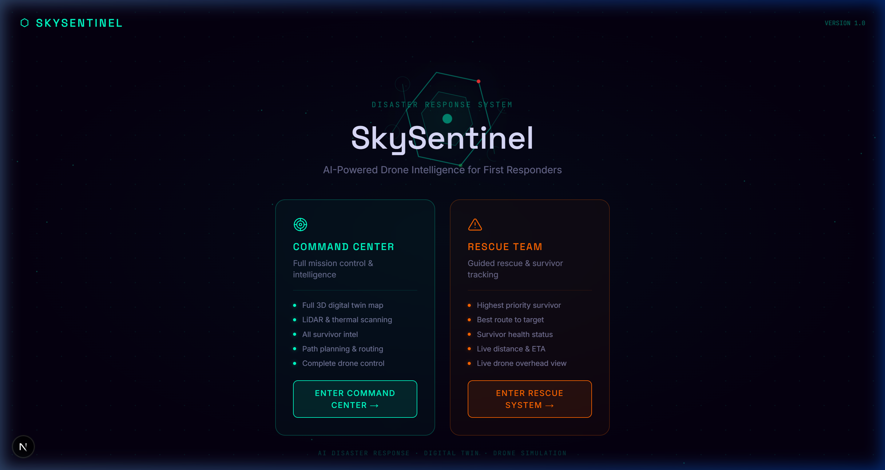
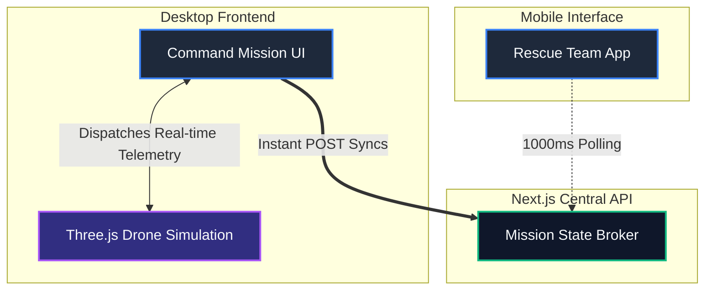

<div align="center">
  
  
  <h1>🚁 SkySentinel</h1>
  <p><b>An autonomous, closed-loop AI disaster response and extraction ecosystem.</b></p>
  
  [](#)
  [](#)
</div>

---

## 💡 The Vision

We built **SkySentinel** because during mass-scale disasters like earthquakes or floods, the "golden hours" dictate survival. First responders routinely fly blind into hazardous, structurally compromised architecture. Historically, mapping these environments takes far too long, and sending scout teams in on foot is incredibly dangerous. 

We didn't just want to build a cool drone flight simulator—we wanted to build a **complete, closed-loop ecosystem**. 

SkySentinel bridges the gap between high-altitude drone scouting and boots-on-the-ground rescue via a synchronized web platform. A commanding officer can deploy an autonomous drone, run rapid LiDAR sweeps, and use thermal mapping to identify survivors. An AI triage system then processes this raw data to generate extraction routes. Those exact routes are immediately beamed to the mobile devices of on-site rescue teams, who use our synchronized mobile app to navigate the wreckage safely.

---

## 📸 Dashboard In Action

*(Drop your screenshots into `public/docs/` and rename them to match these links to display them!)*

<div align="center">
  
  <p><i>The main Command Center. Real-time LiDAR feeds, active drone telemetry, and survivor triage data all in one place.</i></p>
</div>

<div align="center">
  
  <p><i>High-contrast thermal imaging mapping structural hazards, survivor heat signatures, and safety routes.</i></p>
</div>

---

## 🏗️ System Architecture

SkySentinel operates across three main interconnected layers. We intentionally kept the state server light so the simulation and mobile endpoints stay highly responsive.



### Flow Breakdown
1. **The Simulation Engine:** Built on `React Three Fiber`, handling complex mathematical raycasting for LiDAR, drone flight physics with virtual inertia, and custom volumetric shaders for thermal vision.
2. **The Command UI:** A React dashboard pulling active data out of the 3D canvas and sending fire-and-forget sync packets to the Next.js API layer on every mission state transition. 
3. **The Rescue Client:** A lightweight mobile-first interface that polls the server to receive AI-generated navigational graphs, rendering them clearly for ground personnel.

---

## 🎮 Flight Mechanics & Controls

We wanted the drone to feel weighty and realistic, so we built a custom physics damper alongside our dynamic First Person View (FPV).

- **W/A/S/D** : Horizontal translations along the X and Z axes.
- **↑ / ↓ (Arrows)** : Vertical altitude climbing and descension.
- **Mouse Drag** : 360-degree orbital camera rotation / pitch / yaw.
- **F** : Toggle Fullscreen Immersion Mode.
- **Esc** : Break tether / Exit FPV.

When using FPV, the standard cursor gracefully turns into a **dynamic virtual joystick reticle** with simulated elastic inertia.

---

## 🚀 Getting It Running (Locally)

Because this project utilizes heavy, high-fidelity 3D map models, **you absolutely have to pull the models via Git LFS**. If you skip step 3, the engine will crash trying to render text files as 3D meshes.

### 1. Clone & Install
```bash
git clone https://github.com/Adesuwa007/Sky-Sentinel.git
cd Sky-Sentinel
npm install
```

### 2. The Git LFS Hook (CRITICAL)
If you don't have git-lfs installed on your machine yet, install it first:
```bash
git lfs install
```
Then deliberately fetch the binary assets:
```bash
git lfs pull
```

> **Wait, my models still aren't loading!** 
> If LFS is blocked by your network/permissions, no worries. Go to our submission page, download `models.zip`, and manually extract those `.glb` files directly into `/public/models/`.

### 3. Spin it up
For normal desktop testing:
```bash
npm run dev
```
*Head over to `http://localhost:3000` to assume command.*

### 4. Testing the Mobile App
To test the synchronized ground team interface (`/rescue`), your mobile browser requires a secure HTTPS context. 
If your CLI supports it natively: `next dev --experimental-https`
Otherwise, we highly recommend piping it through ngrok:
```bash
ngrok http 3000
```
Then visit that HTTPS link on your phone!

---

## 🔮 What's Next?

We're incredibly proud of what we built in such a short hackathon window, but here is where we want to take SkySentinel next:
1. **WebSocket Refactor:** Replacing our lightweight 1-second API polling with pure, low-latency socket pipelines so the ground teams see the extraction route literally drawing itself in front of them with zero lag.
2. **LLM Triage Agents:** Piping the survivor health/hazard data organically retrieved from the mapped matrix into a localized LLM to generate custom, rapid medical instructions for the extraction team based on what the thermal optics saw. 
3. **Wind & Aerodynamics:** Adding global wind vector matrices that naturally push and sway the drone, forcing commanders to manually combat drafts when navigating tight collapsed structures.
4. **Augmented Reality (WebXR):** While we currently have the synchronized mobile UI running, we plan to fully implement WebXR so ground teams can see the exact holographic waypoints overlaid onto the real world using their device cameras.
