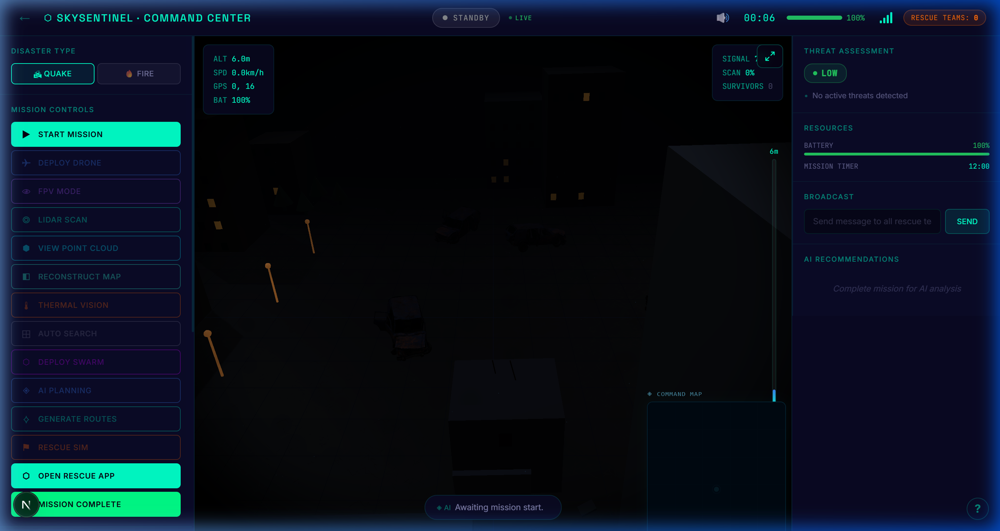
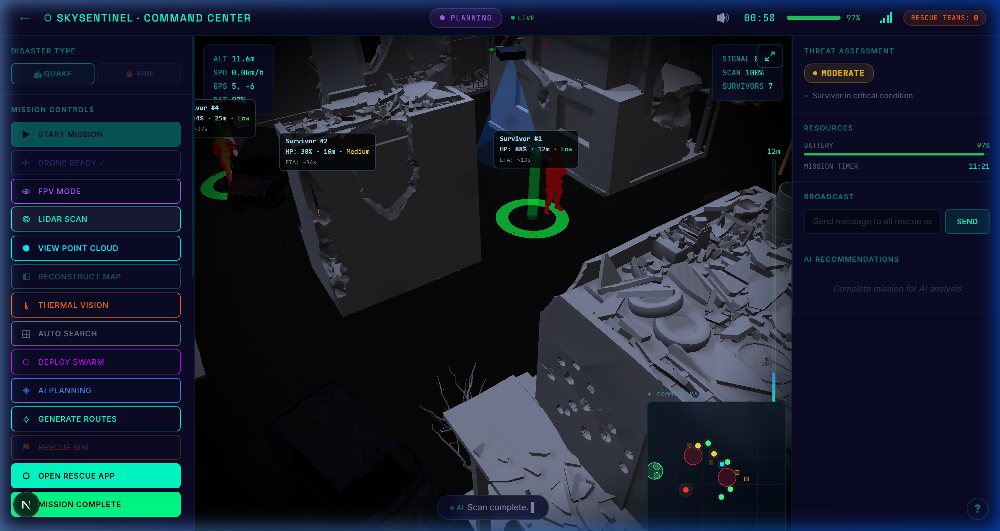
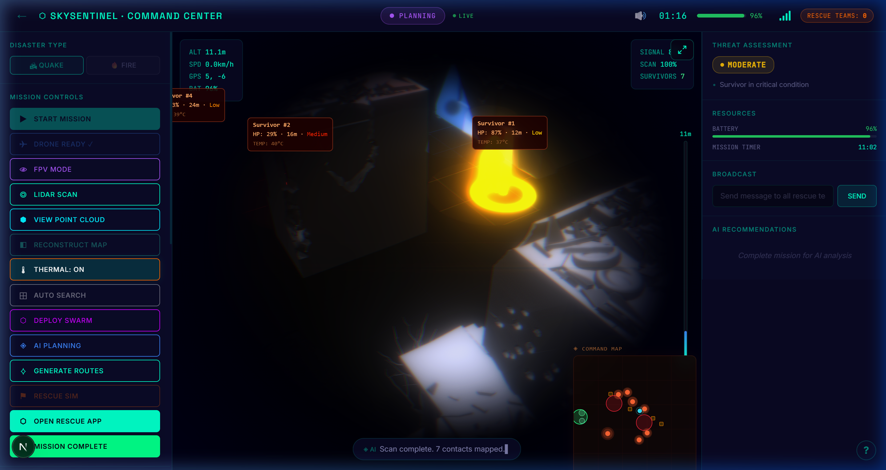
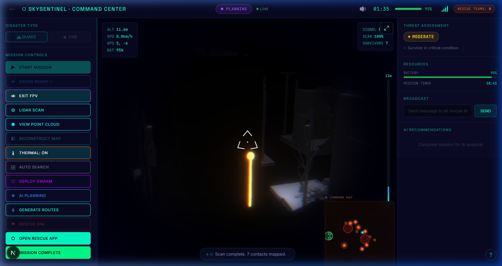
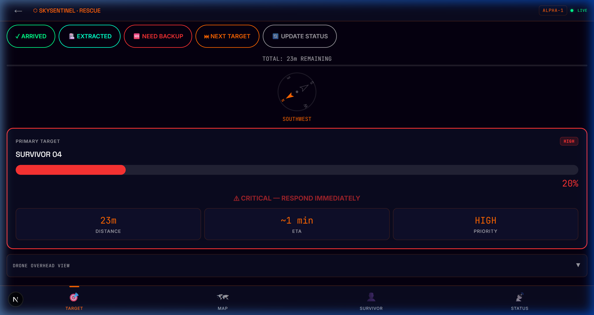

# Sky Sentinel – AI Disaster Response System

**Version 1.0** | Next.js + Three.js + WebXR | Hackathon Submission

---

## Table of Contents

1. [Project Overview](#1-project-overview)
2. [Problem Statement](#2-problem-statement)
3. [Proposed Solution](#3-proposed-solution)
4. [UI Screenshots](#4-ui-screenshots)
5. [System Architecture](#5-system-architecture)
6. [Role of LiDAR in Sky Sentinel](#6-role-of-lidar-in-sky-sentinel)
7. [Dual Dashboard System](#7-dual-dashboard-system)
8. [Features](#8-features)
9. [Tech Stack](#9-tech-stack)
10. [Installation Guide](#10-installation-guide)
11. [Controls](#11-controls)
12. [Project Structure](#12-project-structure)
13. [3D Assets and Models](#13-3d-assets-and-models)
14. [Real-World Applications](#14-real-world-applications)
15. [Monetization / Business Model](#15-monetization--business-model)
16. [Future Scope](#16-future-scope)
17. [Conclusion](#17-conclusion)

---

## 1. Project Overview

Sky Sentinel is an AI-powered disaster response system that uses drone-mounted sensors, simulated LiDAR scanning, thermal imaging, and 3D environmental mapping to support search-and-rescue operations in disaster zones.

When a disaster strikes — a collapsed building, a wildfire, or an earthquake — the first critical challenge is situational awareness. Rescue teams need to know the layout of the damaged area, where survivors are located, and which paths are safe to travel. Gathering this information manually is slow, dangerous, and often incomplete.

Sky Sentinel addresses this by deploying a virtual drone over the disaster area. The drone scans the environment using simulated LiDAR, generates a 3D point cloud map in real time, identifies survivors through thermal detection, assigns rescue priorities based on health status, and computes the most efficient rescue routes using A* pathfinding. All of this data flows into two synchronized dashboards — one for command center operators, and one for rescue teams in the field.

The system simulates the full pipeline of a real-world drone-based rescue operation, from aerial deployment to final extraction, in a browser-based 3D environment built on Three.js and React Three Fiber.

---

## 2. Problem Statement

During mass-scale disasters, rescue teams frequently operate without accurate maps of the affected terrain, which slows response time, increases risk to responders, and reduces the chances of survivor recovery. Traditional scouting methods are too slow and too dangerous for time-critical operations.

---

## 3. Proposed Solution

Sky Sentinel provides a drone-based digital twin of the disaster environment. A simulated drone is deployed over the area, performs a LiDAR scan to generate a 3D point cloud map, detects survivors using thermal imaging, ranks them by urgency, and calculates optimized rescue paths. This information is streamed to a command center dashboard for operators and to a mobile-ready rescue dashboard for field teams, enabling coordinated, data-driven rescue operations.

---

## 4. UI Screenshots

The following screenshots show the Sky Sentinel interface across its primary operational states.

**Hero Banner — Landing Page**

The entry point presents two access paths: the Command Center for operators and the Rescue Team interface for field personnel. The landing page communicates the full scope of the system at a glance.


---

**Command Center — Standby State**

The 3D disaster environment loads immediately on mission start. The environment shows a collapsed urban zone rendered in full 3D. Mission controls are visible in the left panel. Threat assessment, battery status, and mission timer are shown on the right.



---

**Command Center — LiDAR Scanning**

The drone initiates a LiDAR scan. A glowing cone emits from the drone's position and the scan percentage updates in real time. The environment is progressively revealed as the scan progresses. The left panel shows the active "LiDAR Scan" button highlighted.



---

**Command Center — Thermal Vision Active**

With thermal vision enabled, the scene lighting shifts to an infrared simulation. Survivor models glow in orange and red heat signatures. Each detected survivor displays an information card showing health percentage, distance, priority level, and body temperature. The safe zone and evacuation markers are visible in the background.



---

**Command Center — Planning Phase with FPV**

After the scan is complete, the system enters Planning mode. The operator is in FPV (First-Person View) looking through the drone's perspective. Survivor #2 is highlighted with a data card showing 49% HP, 30-minute survival window, and Low priority. The minimap in the bottom-right shows all survivor positions and danger zones.



---

**Survivor Dashboard — Critical Survivor View**

The mobile rescue interface in the Survivor tab. Survivor 05 is at 27% health, detected via LiDAR. The health decline rate is shown as -0.12% every 5 seconds. The health timeline graph shows a sharp decline. The survival window shows approximately 18 minutes remaining. The critical response instructions are displayed prominently, directing the rescue team to perform immediate extraction.



---

## 5. System Architecture

The full Sky Sentinel pipeline runs as follows:

```
Drone Deployment
      |
      v
LiDAR Scan (Raycasting)
      |
      v
Point Cloud Generation
      |
      v
3D Environment Reconstruction
      |
      v
Thermal Vision Overlay
      |
      v
Survivor Detection
      |
      v
Priority Assignment (Critical / Medium / Low)
      |
      v
A* Path Planning (Safest / Fastest / Balanced)
      |
      v
Rescue Guidance Output
      |
      +---------------------------+
      |                           |
      v                           v
Command Center Dashboard    Survivor / Rescue Dashboard
(Desktop – Operators)       (Mobile – Field Teams)
      |                           |
      +---------------------------+
                  |
                  v
         AR View (Mobile / WebXR)
```

**Step-by-step explanation:**

- **Drone Deployment:** The operator deploys the drone from the command center. A cinematic deployment animation initiates the mission. The drone hovers over the 3D environment and is ready for operator control.

- **LiDAR Scan:** The drone emits simulated LiDAR rays using `THREE.Raycaster`. These rays spread out in expanding circular patterns from the drone's current altitude, hitting surfaces below — buildings, debris, the ground.

- **Point Cloud Generation:** Every surface hit by a LiDAR ray generates a data point. These points are aggregated into a `THREE.BufferGeometry` and rendered as a glowing green particle cloud over the scene. This is the raw LiDAR output, or "point cloud."

- **3D Environment Reconstruction:** Once sufficient points have been collected, the operator can trigger a map reconstruction step. This translates the point cloud data into a navigable 3D representation of the disaster zone, including collapsed structures and open paths.

- **Thermal Vision Overlay:** The operator activates thermal vision mode. The scene's lighting and material properties are modified — biological targets (survivors) glow in red and orange, representing heat signatures. A CSS film grain and scanline overlay re-creates the visual appearance of a thermal camera feed.

- **Survivor Detection:** Survivors located beneath debris or in obscured areas are revealed as the LiDAR scan progresses. Each detected survivor is assigned a health percentage, decline rate, and urgency level.

- **Priority Assignment:** The AI triage system ranks survivors by urgency — Critical, Medium, or Low — based on their current health, rate of deterioration, and proximity to active hazard zones.

- **A* Path Planning:** For each high-priority survivor, the engine computes three route variants using an A* algorithm with a Manhattan-distance heuristic: Safest (avoiding all hazard radii), Fastest (shortest geometric path), and Balanced (trade-off between distance and risk). These routes are represented as 3D path overlays on the map.

- **Rescue Guidance Output:** The computed paths and survivor data are written to the Next.js in-memory state broker via API routes, making them available to both dashboards.

- **Command Center Dashboard:** The desktop interface provides operators with the full picture — 3D map, LiDAR feed, survivor list, route overlays, drone telemetry, threat assessment, and broadcast controls.

- **Survivor / Rescue Dashboard:** The mobile interface gives field teams their assigned target, live distance, ETA, survivor health status, evacuation instructions, and a top-down map of their route.

- **AR View:** The rescue dashboard includes a WebXR-enabled AR mode for mobile devices, allowing field teams to see rescue waypoints overlaid on their real-world camera view.

---

## 6. Role of LiDAR in Sky Sentinel

**What is LiDAR?**

LiDAR stands for Light Detection and Ranging. It is a remote sensing technology that uses laser pulses to measure distances to objects, generating highly accurate 3D maps of an environment. In real-world disaster response, drones equipped with LiDAR can scan collapsed structures, map terrain, and identify open voids where survivors may be located.

**How LiDAR is simulated in this project:**

Sky Sentinel simulates LiDAR using Three.js raycasting. The drone emits hundreds of virtual rays downward in expanding circular patterns from its current position. Each ray checks for intersections with scene geometry — buildings, rubble, ground meshes. When an intersection is detected, a glowing point is created at that coordinate and added to a shared `THREE.BufferGeometry` point cloud. As the scan progresses, this cloud fills in to form an accurate 3D representation of the environment below. The scan percentage updates in real time in the UI.

**Why LiDAR matters for disaster response:**

- LiDAR can penetrate smoke and low-visibility conditions that make optical cameras useless.
- It provides centimeter-level accuracy for mapping debris and structural damage.
- It reveals voids and gaps in rubble — the cavities where survivors are most likely to be trapped.
- It generates data that can be fed directly into pathfinding algorithms to compute navigable rescue routes.

In Sky Sentinel, the LiDAR simulation is the core data collection step. Nothing downstream — survivor detection, path planning, or rescue routing — can happen until the LiDAR scan is complete.

---

## 7. Dual Dashboard System

Sky Sentinel operates two parallel interfaces that are synchronized through a shared Next.js API state layer.

**Command Center Dashboard (`/command`)**

The command center is the primary control interface for rescue operators and mission commanders. It presents a full 3D viewport of the disaster zone, rendered in real time using React Three Fiber. From this interface, the operator can:

- Deploy the drone and control it using keyboard and mouse
- Initiate LiDAR scanning and view the growing point cloud
- Switch to thermal vision to locate survivors
- Review survivor priority rankings and health data
- Select and visualize rescue routes (Safest, Fastest, Balanced)
- Broadcast messages to field rescue teams
- Monitor mission timer, battery level, and drone telemetry
- Generate a post-mission PDF report

**Survivor / Rescue Dashboard (`/rescue`)**

The rescue dashboard is a mobile-first interface designed for field operatives working inside the disaster zone. It receives data from the command center via API polling and displays:

- Highest-priority survivor target with health status and survival window
- Live distance and estimated time of arrival (ETA) to the target
- A top-down map of the disaster area with the rescue route marked
- Survivor's current health trend (declining, stable, critical)
- Emergency instructions from the command center
- Drone overhead position for spatial orientation
- Action buttons: Arrived, Extracted, Need Backup

**Why two dashboards improve rescue efficiency:**

Command center operators have situational awareness of the entire scene but are not in the field. Field responders are in the field but lack the overhead view. Splitting the interface means each user gets exactly the information they need in the format best suited to their role. The operator sees everything; the field team sees only what matters for immediate action. The synchronization ensures that when the operator marks a survivor as high priority, the field team's device updates automatically, with no manual communication required.

---

## 8. Features

**Drone Deployment**

The operator initiates the mission by clicking "Deploy Drone." A cinematic animation plays, bringing the drone in from outside the operational area and landing it at the center of the grid. Mission controls are locked until the drone is confirmed ready.

**Drone Navigation (WASD + Arrow Keys)**

Once deployed, the drone is fully pilot-controlled. WASD keys control horizontal movement. Arrow Up and Arrow Down (or Page Up / Page Down) control altitude. Movement uses spring-based damping to simulate real aerial inertia, including pitch and roll during translation.

**FPV Mode**

The operator can switch to First-Person View (FPV) to pilot the drone from the drone's perspective. In FPV mode, a dynamic reticle replaces the cursor to represent the drone's heading. Exiting FPV returns to the orbital third-person camera.

**LiDAR Scan and 3D Mapping**

Clicking "LiDAR Scan" initiates the scanning sequence. The drone emits simulated rays, and a glowing point cloud builds up in real time across the 3D environment. Once complete, the operator can click "Reconstruct Map" to transition from point cloud view to a fully rendered 3D map with all detected geometry visible.

**Thermal Vision**

Activating thermal vision applies a post-processing overlay to the 3D viewport. Scene lighting is modified to simulate infrared. Survivor models emit red and orange glow materials representing heat signatures. CSS scanlines and film grain are layered over the canvas to simulate an actual thermal camera display.

**Survivor Detection**

As the LiDAR scan reveals the environment, survivor models are progressively uncovered. Each survivor is assigned a name, health percentage, health decline rate, a priority level (Critical / Medium / Low), position coordinates, and distance from the evacuation zone.

**Priority-Based Rescue System**

The AI triage engine ranks all detected survivors by urgency. Survivors with the fastest health decline and lowest current health are marked Critical. This ranking determines which survivor the rescue team is directed to first and drives the path planning calculations.

**A* Path Planning**

From each survivor's position to the evacuation zone, the A* algorithm computes three route options. The pathfinder uses a grid representation of the environment and applies different cost functions: heavy hazard penalties for the safest route, no penalties for the fastest route, and a weighted balance for the third option. Routes are rendered as 3D path lines in the viewport.

**AR View on Mobile**

The rescue dashboard supports WebXR on compatible mobile browsers. Rescue teams can activate the AR view to see directional rescue waypoints overlaid on the live camera feed of their physical surroundings, reducing the need to constantly reference the 2D map.

**Real-Time Mission Dashboard**

Both dashboards receive live updates through API polling. The command center reflects drone telemetry, scan progress, survivor status changes, and field team activity. The rescue dashboard reflects survivor priority, route data, and command messages in near real time, with a live signal status indicator that degrades if the polling connection weakens.

**Post-Mission PDF Report**

After a mission is completed, the operator can generate and download a full PDF report. The report includes survivor details, health metrics, risk assessments, route efficiency data, battery usage, and mission timing, suitable for administrative and operational review.

---

## 9. Tech Stack

| Category | Technology |
|---|---|
| Frontend Framework | Next.js 16 (App Router), React 19, TypeScript |
| 3D Engine | Three.js, React Three Fiber (R3F), Drei |
| Augmented Reality | WebXR API (mobile browser) |
| Styling | Vanilla CSS (scoped per module) |
| Backend / API | Next.js Route Handlers (serverless, in-memory state) |
| PDF Generation | jsPDF |
| 3D Assets | GLB format — processed in Blender / Unity |
| Version Control | Git + Git LFS (for large binary model files) |
| Local Deployment | `npm run dev` / Ngrok for mobile HTTPS tunneling |

---

## 10. Installation Guide

Follow these steps in order. Do not skip the Git LFS step — the 3D models are stored as binary assets and will not load correctly without it.

**Step 1: Clone the repository**

```bash
git clone https://github.com/Adesuwa007/Sky-Sentinel.git
cd Sky-Sentinel
```

**Step 2: Install dependencies**

```bash
npm install
```

**Step 3: Set up Git LFS and pull model files**

If you do not have Git LFS installed, install it first:

```bash
git lfs install
```

Then pull the large binary files:

```bash
git lfs pull
```

> If Git LFS is blocked on your network or institution, download `models.zip` from the submission page and extract it directly into `/public/models/`. The folder should contain the `.glb` files: `collapsed-building.glb`, `survivor.glb`, `car.glb`, `tree.glb`, and `streetlight.glb`.

**Step 4: Start the development server**

```bash
npm run dev
```

Open `http://localhost:3000` in your browser. This loads the landing page where you can enter either the Command Center or the Rescue System.

**Step 5: Testing the mobile rescue interface**

The rescue dashboard requires HTTPS to function properly on mobile browsers. Run the server with HTTPS enabled:

```bash
npm run dev -- --experimental-https
```

Then find your machine's local IP address (e.g., `192.168.x.x`) and open `https://192.168.x.x:3000/rescue` on your mobile device. Alternatively, use Ngrok to create a public HTTPS tunnel:

```bash
ngrok http 3000
```

Visit the Ngrok HTTPS URL on your phone.

---

## 11. Controls

| Input | Action |
|---|---|
| W / A / S / D | Move drone forward, left, backward, right |
| Arrow Up / Page Up | Increase drone altitude |
| Arrow Down / Page Down | Decrease drone altitude |
| Mouse Drag | Rotate orbital camera (third-person view) |
| F | Toggle fullscreen immersion mode |
| Esc | Exit FPV mode / break camera tether |
| UI: Deploy Drone | Initiates drone deployment animation |
| UI: LiDAR Scan | Begins the raycasting scan sequence |
| UI: View Point Cloud | Switches viewport to raw point cloud display |
| UI: Reconstruct Map | Rebuilds the 3D environment from scan data |
| UI: Thermal Vision | Activates thermal imaging overlay |
| UI: FPV Mode | Enters first-person drone view |
| UI: Generate Routes | Computes A* rescue paths |
| UI: Open Rescue App | Opens the rescue dashboard (for mobile team) |

---

## 12. Project Structure

```
drone-disaster-frontend/
|
+-- app/
|   |
|   +-- api/
|   |   +-- broadcast/route.ts          # Command-to-team broadcast messaging
|   |   +-- mission-state/route.ts      # In-memory master mission state store
|   |   +-- mission/route.ts            # Mission lifecycle management
|   |   +-- report/route.ts             # PDF data aggregation endpoint
|   |   +-- rescue-status/route.ts      # Field team action tracking (EXTRACTED, ARRIVED)
|   |   +-- rescue-teams/route.ts       # Heartbeat monitor for connected field devices
|   |
|   +-- command/
|   |   +-- CCLeftPanel.tsx             # Mission controls, left sidebar UI
|   |   +-- CCMissionComplete.tsx       # End-of-mission modal and PDF trigger
|   |   +-- CCOverlays.tsx              # HUD overlays (altitude, speed, battery, GPS)
|   |   +-- CCRightPanel.tsx            # Threat assessment, routes, broadcast input
|   |   +-- CCTopNav.tsx                # Top navigation bar with signal and timer
|   |   +-- CommandCenter.tsx           # Main controller binding 3D canvas and UI state
|   |   +-- FPVReticle.tsx              # Dynamic crosshair for first-person view
|   |   +-- command.css                 # Scoped CSS for command center interface
|   |   +-- page.tsx                    # Next.js route entry for /command
|   |
|   +-- components/
|   |   +-- ModelHelpers.tsx            # React Three Fiber GLB model loaders
|   |   +-- ParticleBackground.tsx      # Animated particle effect for landing page
|   |   +-- Scene.tsx                   # Core 3D scene: raycasting, lighting, geometry
|   |   +-- SplineDrone.tsx             # Drone physics, animation, propeller spin
|   |   +-- ui.tsx                      # Shared UI components including minimap canvas
|   |
|   +-- lib/
|   |   +-- data.ts                     # Seeded procedural generation (buildings, hazards, survivors)
|   |   +-- helpers.ts                  # A* pathfinding algorithm
|   |   +-- pdfReport.ts                # jsPDF report generation logic
|   |   +-- types.ts                    # Shared TypeScript interfaces and enums
|   |
|   +-- rescue/
|   |   +-- RescueApp.tsx               # Mobile rescue interface (4-tab state machine)
|   |   +-- RescueMap.tsx               # HTML5 Canvas 2D top-down map renderer
|   |   +-- rescueHelpers.ts            # Utility functions for rescue calculations
|   |   +-- rescue.css                  # High-contrast mobile-first styling
|   |   +-- page.tsx                    # Next.js route entry for /rescue
|   |
|   +-- DisasterDroneSimulator.tsx      # Top-level simulation state machine
|   +-- SimulatorClientGate.tsx         # Client-side rendering gate for 3D components
|   +-- globals.css                     # Root CSS variables and font declarations
|   +-- landing.css                     # Landing page animation styles
|   +-- layout.tsx                      # Next.js root layout with font injection
|   +-- page.tsx                        # Landing page (entry point)
|
+-- public/
|   +-- models/
|       +-- car.glb                     # Vehicle model
|       +-- collapsed-building.glb      # Primary disaster environment model
|       +-- streetlight.glb             # Environmental detail model
|       +-- survivor.glb                # Survivor character model
|       +-- tree.glb                    # Vegetation model
|
+-- certificates/                       # Locally generated HTTPS certificates for mobile testing
+-- next.config.ts                      # Next.js and Webpack configuration
+-- package.json                        # Project dependencies and scripts
+-- tsconfig.json                       # TypeScript configuration
+-- .gitattributes                      # Git LFS tracking rules for .glb files
```

---

## 13. 3D Assets and Models

All 3D models used in Sky Sentinel were sourced from publicly available 3D model libraries and open LiDAR datasets. The models were selected to accurately represent disaster zone environments, including collapsed urban structures, emergency vehicles, and human-scale figures for survivor representation.

After sourcing, each model was imported into Blender and Unity for processing:

- Polygon reduction to optimize real-time rendering performance in WebGL
- UV unwrapping and material consolidation to reduce draw calls
- Rig cleanup and pose correction for survivor models
- Export to GLB format (binary GLTF), which is compatible with Three.js and React Three Fiber out of the box

The GLB format was chosen because it packages geometry, materials, and textures into a single binary file, reducing HTTP requests and simplifying model loading in the browser. The models are tracked using Git LFS due to their file sizes (ranging from 35 MB to 130 MB).

---

## 14. Real-World Applications

Sky Sentinel's core pipeline — drone deployment, LiDAR mapping, thermal survivor detection, AI path planning, and coordinated field guidance — is directly applicable to real-world scenarios:

**Earthquakes and Collapsed Buildings**
Drones equipped with LiDAR can rapidly scan debris fields and identify structural voids, guiding rescue teams to the most likely survivor locations without requiring human scouts to enter unstable structures first.

**Wildfires**
Thermal imaging combined with aerial mapping can track fire perimeters in real time, identify trapped individuals, and generate dynamic evacuation routes that update as fire boundaries shift.

**Floods**
Drone overflights can map inundated areas, identify rooftops or elevated positions where survivors may be sheltering, and calculate safe extraction routes through partially submerged terrain.

**Landslides**
LiDAR scanning can rapidly assess the post-slide terrain, identify buried structures, and support geotechnical hazard assessment to protect rescue teams from secondary slides.

**Industrial Accidents**
In chemical plant explosions or structural failures, drone-based mapping eliminates the need to send personnel into unknown environments, while thermal imaging can identify both survivors and heat sources such as chemical fires or pressure vessels.

**Military Search and Rescue Operations**
The dual-dashboard coordination model applies directly to tactical rescue operations, where command elements need full situational awareness while field elements receive only mission-critical guidance.

---

## 15. Monetization / Business Model

**Government Disaster Management Contracts**
National and regional emergency management agencies require tools for disaster preparedness and response. Sky Sentinel can be licensed as a training and operations platform for civil defense organizations.

**Fire Departments and Rescue Agencies**
Municipal fire departments and search-and-rescue teams can use Sky Sentinel as both a training simulator and an operational planning tool, reducing the need for expensive physical drills.

**Defense and Military**
Military units engaged in humanitarian assistance and disaster relief (HADR) operations represent a high-value customer segment. The system's dual-dashboard coordination model maps directly to command-and-field operational structures.

**Industrial Safety Inspections**
Facilities with complex environments — refineries, mining operations, large warehouses — can deploy drone-based scanning for safety audits, replacing manual inspections in high-risk areas.

**Drone Mapping as a Service**
The LiDAR scanning and 3D reconstruction pipeline can be offered as a standalone service, where operators use the platform to create digital twins of real environments for planning and risk assessment purposes.

**Software Licensing and SaaS Platform**
The core platform can be licensed to drone manufacturers, emergency response technology companies, and government integrators as a SaaS product, with tiered pricing based on mission volume, number of connected field devices, and reporting features.

---

## 16. Future Scope

**Real Drone Integration**
The current system simulates a drone in a browser-based 3D environment. The next development phase would integrate with real drone hardware (DJI, Parrot, or custom builds) through MAVLink or a similar flight control protocol, allowing the platform to process real telemetry and send real control commands.

**Real LiDAR Sensor Integration**
Connecting to actual LiDAR sensors (such as the Velodyne VLP-16 or DJI Zenmuse L1) would replace the simulated raycasting with real point cloud data streamed from the drone, enabling the platform to generate accurate maps of actual disaster environments.

**AI-Based Survivor Detection**
Replacing the current rule-based thermal detection with a trained computer vision model (YOLOv8 or similar) would allow the system to autonomously identify survivors from thermal or RGB drone footage without manual operator input.

**Multi-Drone Swarm Coordination**
Coordinating multiple drones simultaneously would dramatically increase scan coverage and allow the system to divide large disaster areas into zones, with each drone responsible for a section and the results merged into a single unified map.

**Cloud-Based Disaster Management Platform**
Migrating from local in-memory state to a cloud-hosted platform with a persistent database, real-time WebSocket communication, and multi-organization access would enable Sky Sentinel to function as a national-scale disaster coordination tool.

---

## 17. Conclusion

Sky Sentinel demonstrates that the full pipeline of a drone-assisted disaster response system — from aerial deployment and LiDAR mapping through survivor detection, AI triage, and coordinated rescue guidance — can be built and operated in a web browser without specialized hardware.

The system reduces two of the most critical problems in disaster response: the time it takes to understand a disaster environment, and the difficulty of communicating that understanding from command elements to field teams. By generating a 3D map of the disaster zone in real time and instantly routing that information to mobile rescue dashboards, Sky Sentinel compresses decisions that normally take hours into minutes.

While the current version is a simulation, every component of the pipeline corresponds to real sensor technologies, real algorithms, and real operational workflows used in disaster response. The path from this prototype to a deployable operational system is a matter of hardware integration, not architectural redesign.

Faster information means faster response. Faster response means more lives saved.

---

*Sky Sentinel — AI-Powered Drone Intelligence for First Responders*

*Built for hackathon submission. Open to collaboration, feedback, and continued development.*
